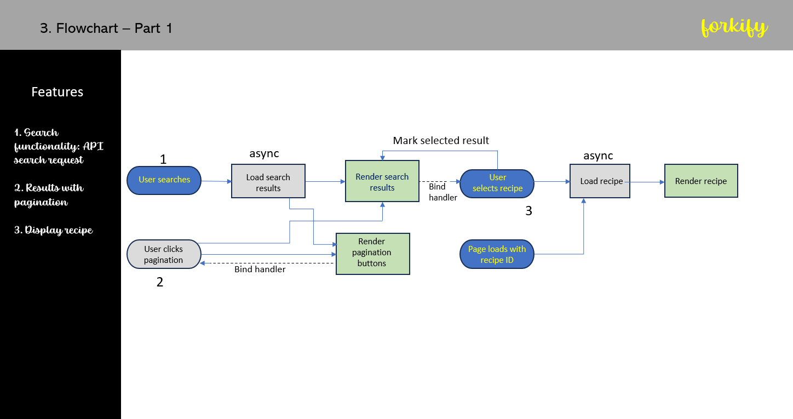

Special credits 🙏 Jonas Schmedtmann

Forkify is a recipe application that uses the Forkify API to fetch and render recipe data. It allows users to search for recipes, bookmark them, adjust serving sizes, and access detailed step-by-step instructions123. The application is built using modern development tools such as Parcel and Babel.

- Project overview
- Loading a recipe from API
- Rendering the recipe
- Listening for load and hashchange events
- The MVC architecture
- Refactoring for MVC
- Helpers and configure files
- Event handlers in MVC: Publisher-Subscriber Pattern
- Implementing error and Success Messages
- Implementing Search results- Part1
- Implementing search results- Part2
- Implementing pagination- Part1
- Implementing pagination- Part2

- Project Planning II
- Updating recipe serving
- Developing a DOM updating algo
- Implementing bookmarks- Part1
- Implementing bookmarks- Part2
- Storing bookmarks with localStorage

- Project Planning III
- Uploading a new recipe-Part1
- Uploading a new recipe-Part2
- Uploading a new recipe-Part3

- Final Considerations

//////////////////////////////////////Project Planning/////////////////////////////////////////////////////

Step---------------------1. User Stories -------------------description of the application's functionality from the user's perspective.
Common format: As a [type of user], i want [an action] so that [a benefit]

$ As a user, i want to search for recipes, so that i can find new ideas for meals
$ As a user, i want to be able to update the number of servings, so that i can cook a meal for different number of people
$ As a user, i want to bookmarks recipe, so that i can review them later
$ As a user, i want to be able to create my own recipes, so that i have them all organized in the same app
$ As a user, i want to be able to see my bookmarks and own recieps when i leave the app and come back later, so that i can close the app after cooking

Step--------------------2. Features ------------------------- User Stories -------->>👉 Features
$ Search for recipes
👉 Search functionality: input field to send request to API with searched keywords
👉 Display results with pagination
👉 Display recipe with cooking time, servings and ingredients

$ Update the number of servings
👉 Change servings functionality: update all ingredients according to current number of servings

$ Bookmark recipes
👉 Bookmarking functionality: display list of all bookmarked recipes

$ Create my own recipes
👉 User can upload own recipes
👉 Users recipes all automatically be bookmarked
👉 User can only see their own recipes, not recipes from other users

$ See my bookmarks and own recipes when i leave the app and come back later
👉 Store bookmark data in the browser using local storage
👉 On the page load, read saved bookmarks from local storage and display

F L O W C H A R T P a r t 1

Important features of the app--Flowchart- Part1: Searching for recipe | Rendering search results | Rendering individual recipe that was selected

